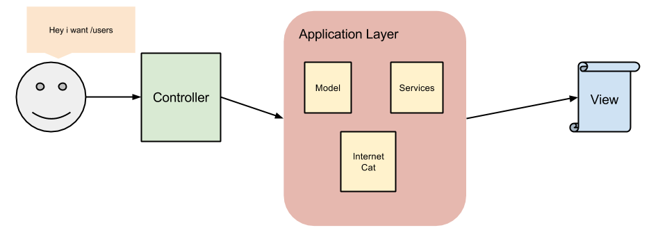
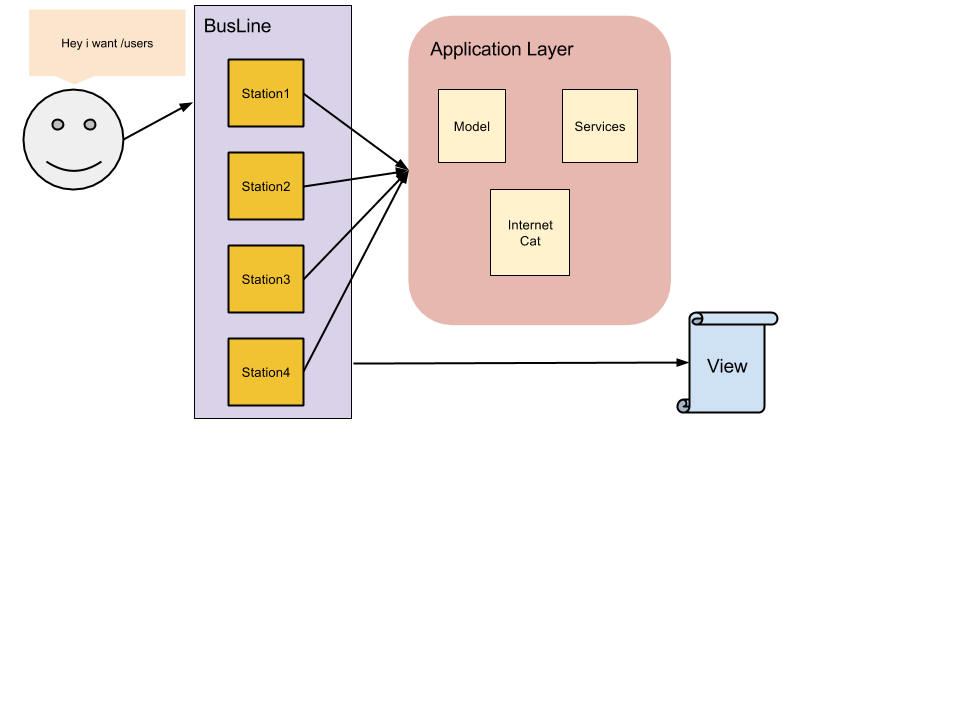

Minibus
=======

Hey welcome to you traveler! You are looking for a way of traveling thrue your
sotware easily ? Do not search anymore, you've just find **the** place!

Ladies and gentleman, let me present the famous, the incredible, the revolutionary
**PHP Minibus** !

## The goal

If you are like me, you are probabling coding software solutions. In many software
architecture the story start by an **Entry point** (cf: a controller in an MVC application). But
if you think about the feature it self of one **Entry Point** you probably agree with
me that it's not only **one point** but a mixed of many **components** in many cases !


In order to avoid what i call **SMFB** architecture (understand : Super Mega
Fuc\*\*\*\* Brain, like a **Controller**) i present you  **Minibus** !


The principle is simple. In order to handle an application **Entry Point** we need
tree **components** :

- A `Minibus`, contains various passengers (understand data).
- Some `Station`, that can handle a minibus at some point (replace the controller).
- Finally a bus `Line` that contains `Station` and can be followed by a `Minibus`

## MVC vs MVB (Model View Bus)

To understand the differences between those two patterns this is some wonderfull
art illustrating the point :


### The MVC


### The MVB


## I can't wait ! Let's start traveling !

You're wondering how it is possible to travel thrue software lands with php, this
is the answer :

```php
use Symfony\Component\EventDispatcher\EventDispatcher;
use Knp\Minibus\Simple\Line;
use Knp\Minibus\Simple\Minibus;

# Before traveling, we need a bus line
$busLine = new Line(new EventDispatcher);

# Okay in order to make all the minibus passengers destination we need to create
# Bus stations !
class DreamlandStation implements Station
{
    public function handle(Minibus $minibus)
    {
        // let's interact with the minibus
        $minibus->addPassenger('sheldon', ['name' => 'sheldon']);
    }
}

# Let's add the station to our bus line :
$busLine->addStation(new DreamlandStation);

# Now we just have to follow the bus line with a minibus :
$busLine->follow(new Minibus);
```

## Getting more !

TODO
